> 注意：安装双系统是一件非常有风险的事情，如果你对整个流程不是很熟悉，建议你不要随便安装，可以先参考观看阅读大量视频文章，理解了其中原理再动手，不然很有可能连Windows都用不了！！！

## 一、准备硬盘和分区

### 1. 准备硬盘

我装这个双系统的时候，特地买了一块500G的机械硬盘，这样我就可以让Mint系统使用整个硬盘了。不过如果你的固态硬盘足够大的话，你也可以把你的固态硬盘重新分区，腾出30-100G的空间给你的Linux系统。甚至于你也可以把系统装在U盘或者其他移动硬盘上。

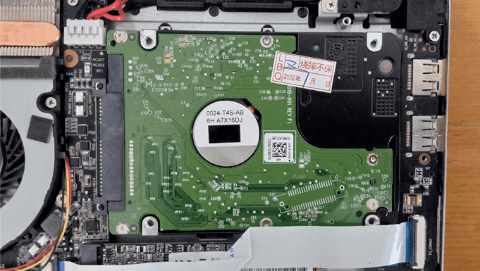

### 2. 分区

分区的目的是让已有的硬盘最终留出30-100G的`Unallocated`空间以方便安装，只有未分区的空间才可以拿来安装系统。

使用整块硬盘的分区方法很简单，只要直接将整个硬盘删除就可以了。比如我要把系统安装在U盘上，具体分区方法是，在Windows的搜索栏中搜索`Create and Format Hard Disk`这个应用然后打开。那么只要选中E盘符，然后右键选择`Delete-Volume`就可以了，操作完成后会显示`Unallocated`。

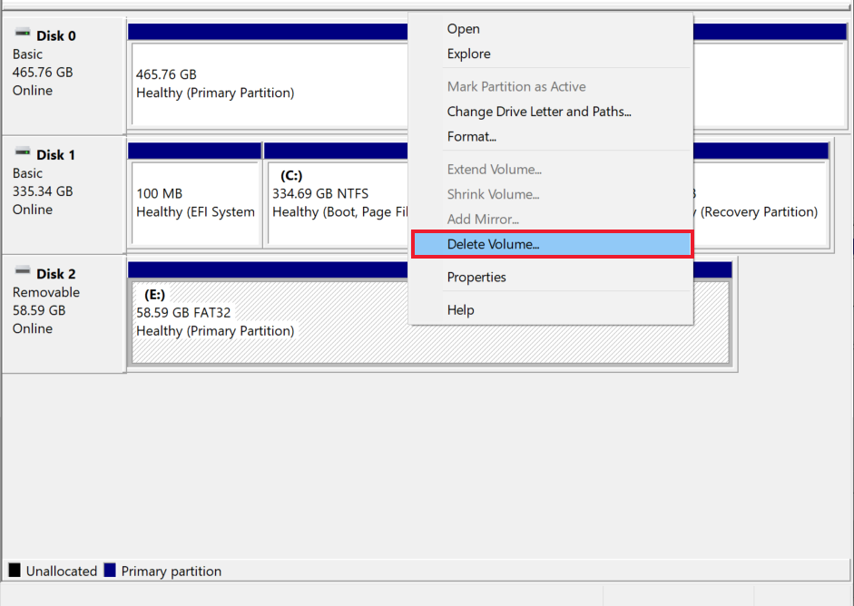

> 注意：已经使用的硬盘也可以分区，比如你本来装有Windows的固态硬盘，但是安装双系统有风险，不建议大家这么做。

## 二、制作系统启动盘

制作USB系统启动盘的目的是为了后面安装Linux系统用的，这个过程和树莓派烧录系统类似。

### 1. 准备系统

烧录当然少不了系统，这边我以[Linux Mint](https://linuxmint.com/)为例，你也可以选择你喜欢的Linux发行版。

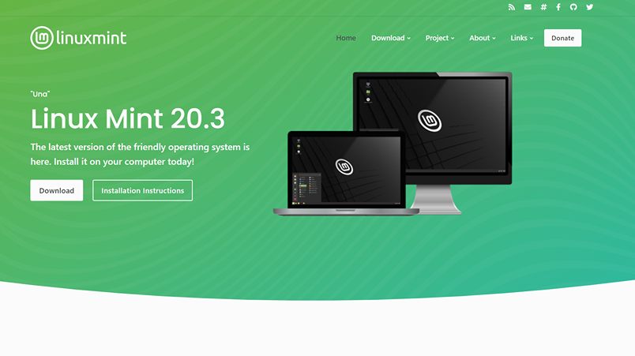

### 2. 安装烧录软件

烧录系统可以使用的软件很多，推荐使用以下三个软件：

|   [Rufus](https://rufus.ie)   | [Etcher](https://www.balena.io/etcher/) | [Raspberry Pi Imager](https://www.raspberrypi.com/software/) |
| :---------------------------: | :-------------------------------------: | :----------------------------------------------------------: |
| 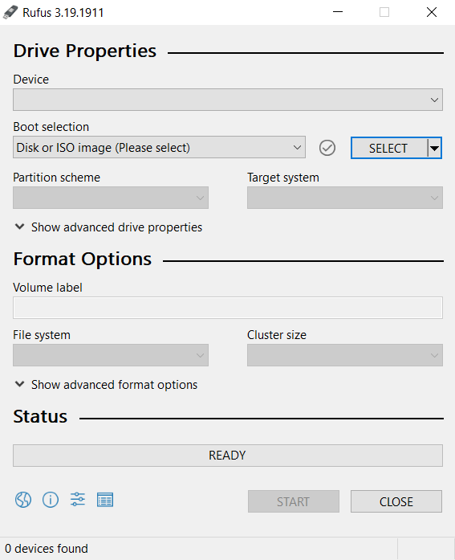 |     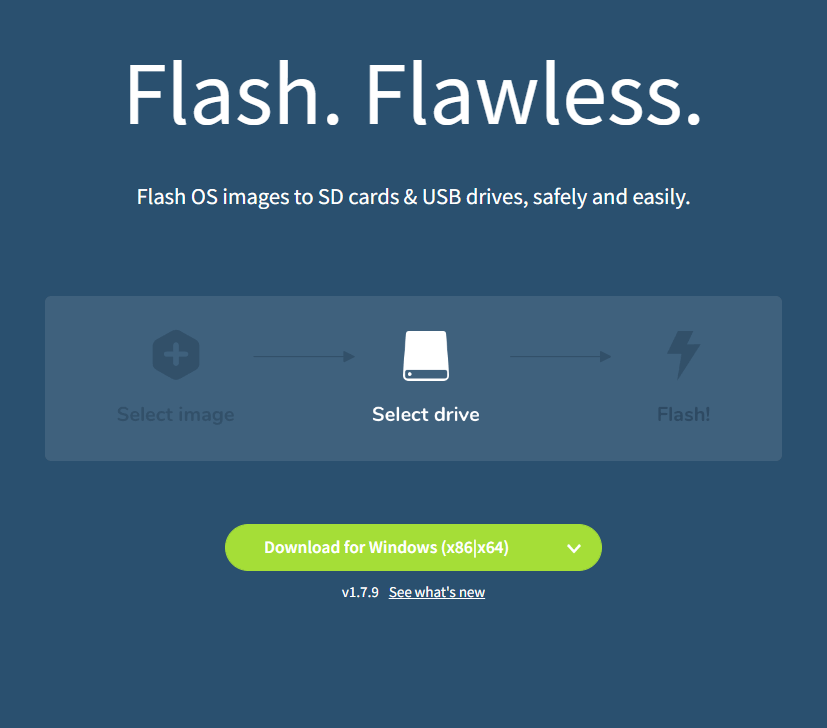     |           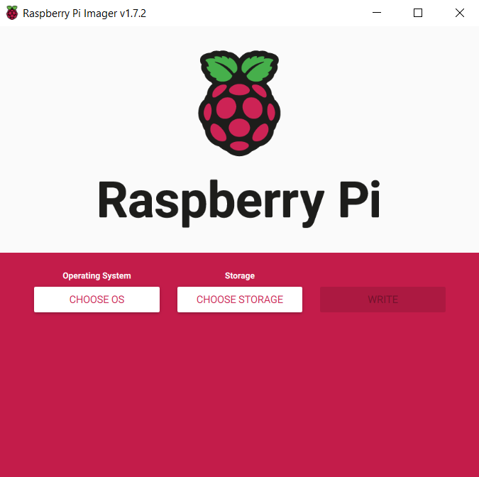            |

### 3. 烧录系统

下面就是插入一个16GB以上的U盘，然后根据你安装的烧录软件烧录你喜欢的Linux系统。

以树莓派Imager为例，一般的流程就是选择系统，选择需要烧录的硬盘，最后烧录就可以了。

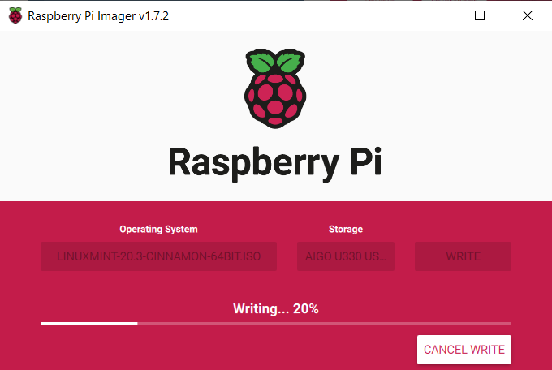

这个过程我就不做详细介绍了，可以参考相应的软件文档或者相关视频。

## 三、进入BIOS

这个步骤根据不同的电脑而定，如果你把你制作好的启动盘插入电脑重启后自动进入了安装界面，那么你可以跳过这个步骤。

如果你的电脑没有自动进入安装界面，那么你可能就要手动进入BIOS后选择对应的U盘。具体方法是电脑在刚刚启动时，按电脑上的`F1~F12`中的一个，具体是哪一个不同品牌的电脑进入BIOS的方法也不同，可以自行上网查找一下。

进入BIOS后到`Boot Override`选项，选择你烧录的U盘回车就可以进入安装界面了。

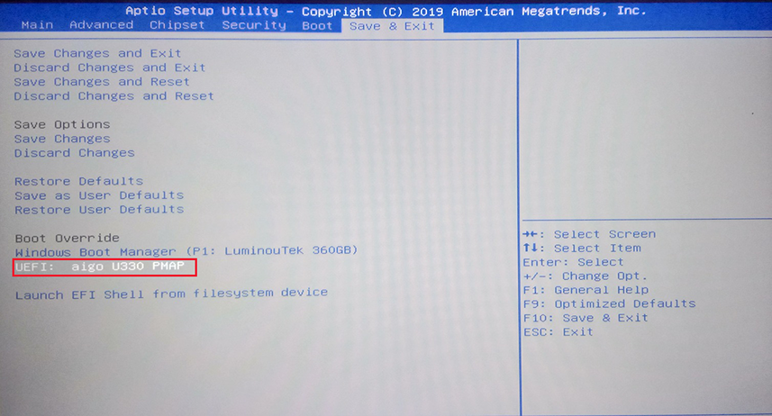

## 四、安装系统

这边我以Mint的安装过程为例进行介绍，由于Mint是基于Ubuntu的发行版，所以安装过程和Ubuntu非常相似，如果你是安装Ubuntu的话可以参考的。

### 1. 选择语言

首先是选择语言，这边我选择英文：

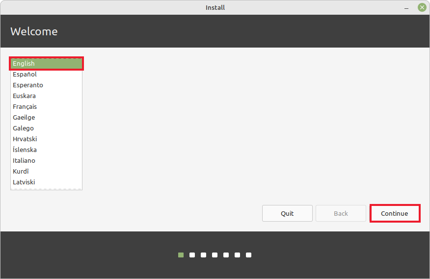

### 2. 键盘布局

然后会让你选择键盘布局，一般都是美式布局：

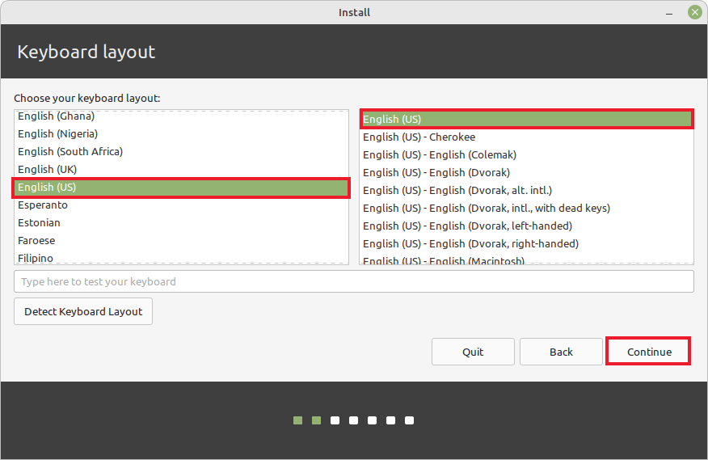

### 3. WiFi

然后会问你是否需要连接WiFi，非常不建议连接WiFi，不然使用国外源的时候安装会非常慢，建议跳过：

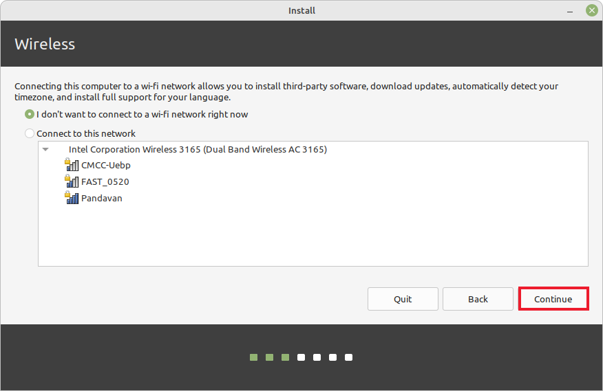

### 4. 多媒体解码器

然后会询问你是否安装多媒体编解码器，因为没有网络，所以不安装，你可以在后面装好系统换了源后在安装：

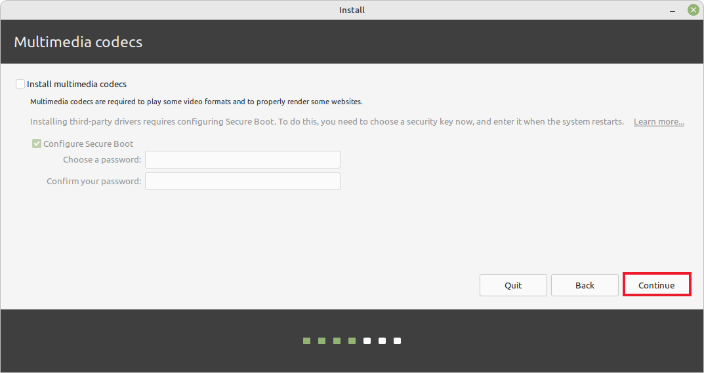

### 5. 安装类型

然后是安装类型，这边我们选择其他类型，也就是自定义类型：

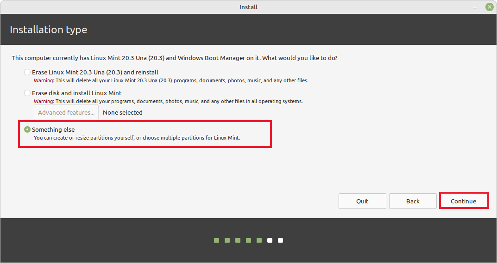

### 6. 系统分区

后面重点就来了，也就是对系统进行分区。

其实目前的电脑配置和个人使用条件来说，分区不需要特别详细，不过你可以参考网上的分区方案。这里最重要还是不能把盘弄错，比如这边的`sda`就是我的机械硬盘，也就是500G的那个。所以我们所有的操作都要在`sda`下操作，其他已有分区不要做任何改动。

因为我们在前面已经对硬盘做了处理，让硬盘处于未分区状态下，也就是`Unallocated`，这时候会显示为`free space`。因为只有`free space`才可以用来分区，所以要分区的话就选中`sda`的`free space`后点击左下角的`+`就可以了。如果你的硬盘没有显示free space，那么你可以选中对应的分区，点击`-`号就可以了。然后就会变成free space了。

> 注意：请确保点击`-`的时候分区没有重要数据，并且是在你刚刚安装的硬盘下，比我的`sda`。

这里我就直接将机械硬盘只分一个根目录，不做其他分区。大家可以参考下面图片进行分区：

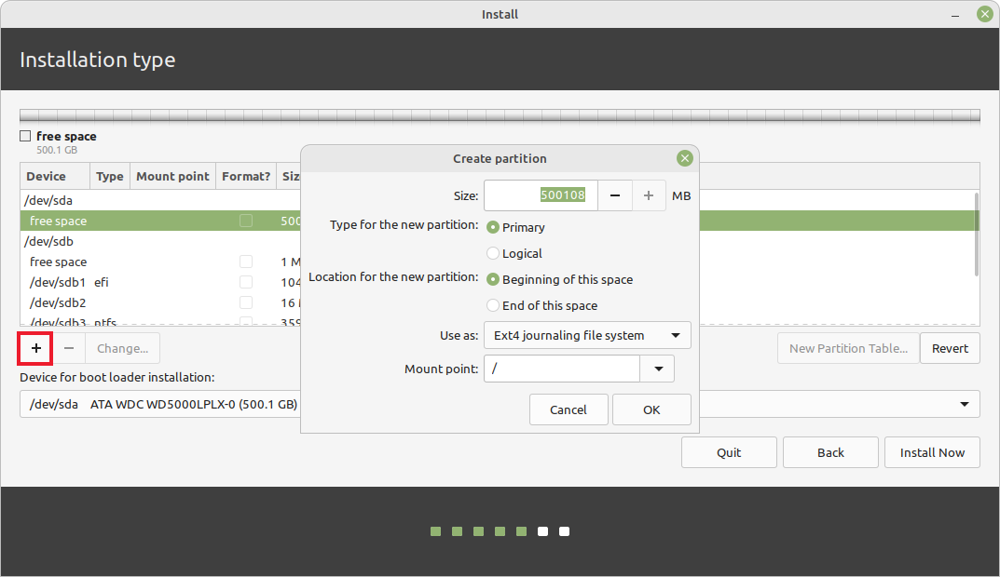

### 7. Bootloader

分区结束后要选择Bootloader的位置，这一点也一定不能错，记得安装在我们分好的根目录下，或者对应的硬盘下面就可以了，这样即使系统安装失败或者删除系统也不会影响我们的固态硬盘。

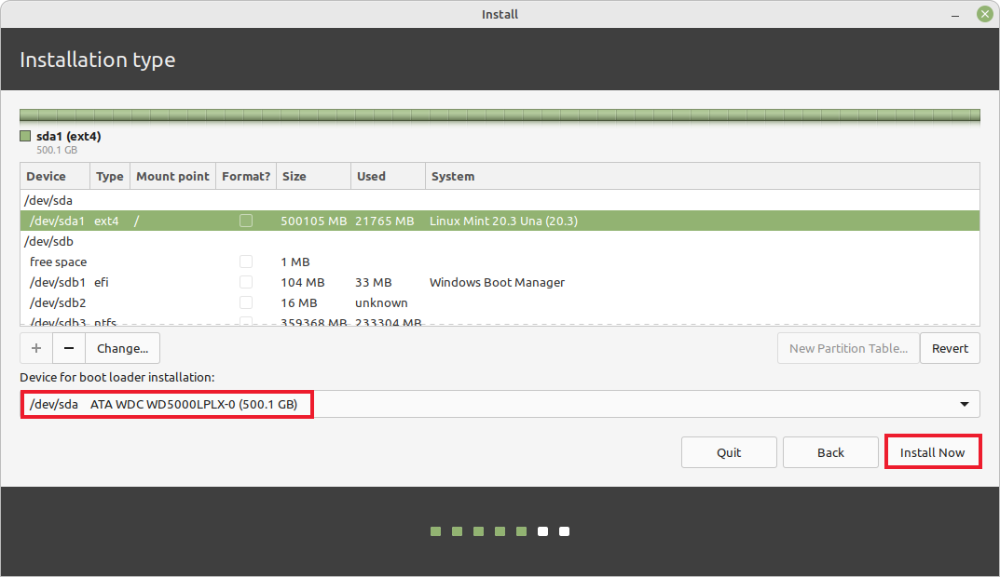

最后点击Install Now直接安装就可以了，应该会弹出其他警示弹窗，选择Continue就好了。

### 8. 时区

下面会让你选择时区，我们就直接选择上海：

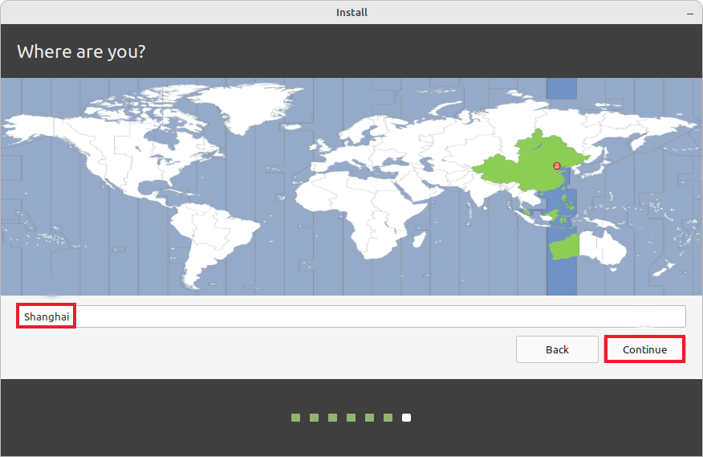

### 9. 主机名和用户名

紧接着会让你配置一下主机名和用户名，配置完就可以安装系统了。

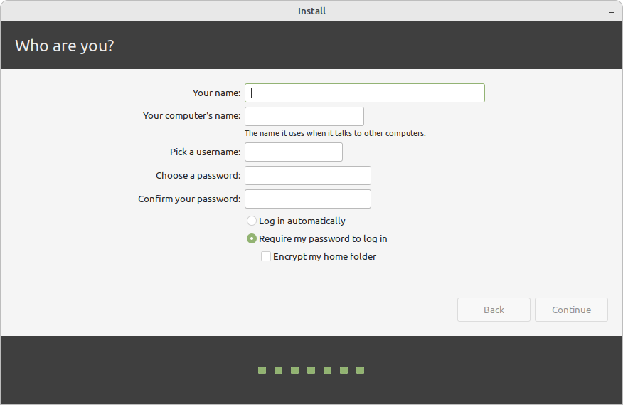

### 10. 完成安装重启电脑

安装完会提示你重启电脑，重启后输入你设置的用户密码就可以看见Mint的欢迎界面了。

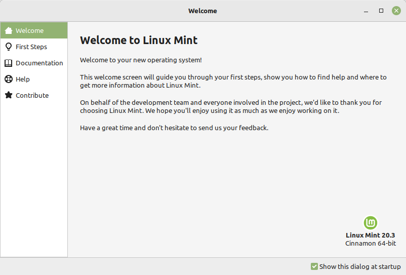

## 五、使用双系统

### 1. 修改Grub

安装好Linux重启后你可能会注意到每次登录都有10s的登录选项等待，这样开机时间会大大延长，手动选择又会很麻烦。解决办法是修改grub配置文件。

首先进入grub的配置文件：

```bash
sudo vim /etc/default/grub
```

找到**GRUB_TIMEOUT=10**这一选项，将其改为**GRUB_TIMEOUT=0**：

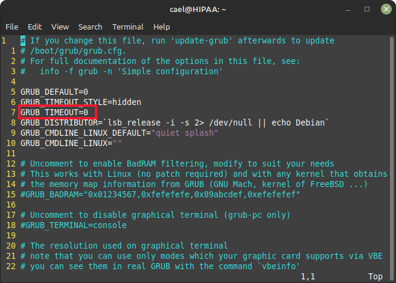

然后再禁止系统修改TIMROUT。

首先进入配置文件：

```bash
sudo vim /etc/grub.d/30_os-prober
```

然后找到最后一行，注释掉**adjust_timeout**：

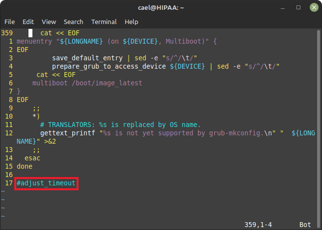

最后更新一下gurb，重启之后就可以生效了：

```bash
sudo update-grub
```

### 2. 修改系统启动项

如果我们想要切换不同的系统，需要修改系统的启动项，进入BIOS找到BOOT将你常用的系统放在第一个就好了。

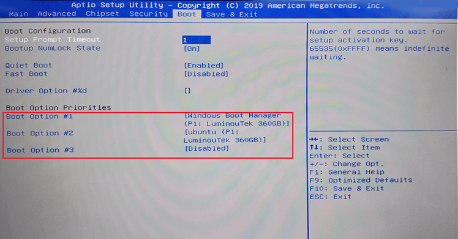

如果只是临时使用，可以进入BIOS后选择对应的BootOverride进入，这和前面进入USB启动盘是一样的。

---
