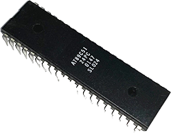
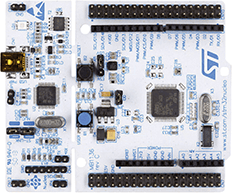
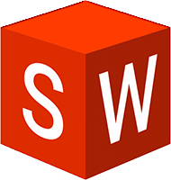
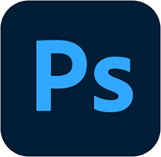


<!-- tab 我主要使用的语言@fab fa-python -->
|           C            |         C++         |          Python          |             Powershell              |
| :--------------------: | :-----------------: | :----------------------: | :---------------------------------: |
|  |  |  |  |
<!-- endtab -->
<!-- tab 我主要使用的单片机@fas fa-microchip -->
|            Arduino            |          C51          |           STM32           |            Pi Pico            |
| :---------------------------: | :-------------------: | :-----------------------: | :---------------------------: |
|  |  |  |  |
<!-- endtab -->
<!-- tab 我主要使用的软件@fas fa-computer -->
|           KiCad           |             Solidworks              |             PhotoShop             |           Matlab            |
| :-----------------------: | :---------------------------------: | :-------------------------------: | :-------------------------: |
|  |  |  |  |
<!-- endtab -->

